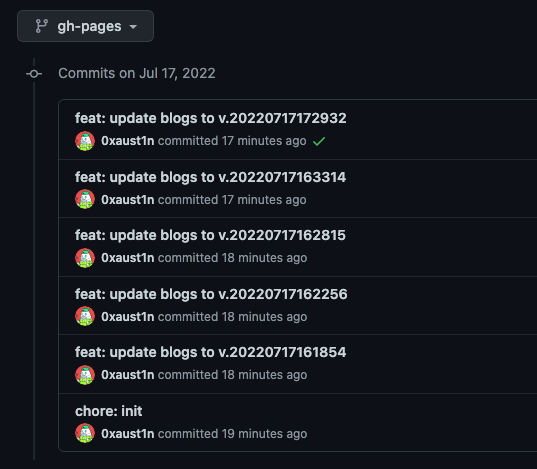

<!--url-->
[github]: https://github.com/liuyib/hexo-theme-stun

## Intro
I have spent half of the day deploying the Hexo to Github pages.  
Cause I'm using the custom theme named [hexo-theme-stun][github] for Hexo Blog.  

> Shout out to the Liuyib for created such a nice theme  

Since I'm cloning the source code from his Github,  
there's no way to push the entire blog to my GitHub but using the `git submodule` .
<!-- more -->
## Git Sub-module
When you're cloning someone's code to your codebase,  
You need to add the submodule by adding the config below

```yml
# fileName: .gitmodules
[submodule "<path>"]
	path = <path>
	url = <github-URL>
	branch = <branch-name>
```
Then use the command below to clone the project.

```bash
git submodule add <URL> <local-path>
```
If the command is not working or getting the error.
You can try this command down below, then try again.

```bash
git rm -r <clone-repo-path> --cached
```

But If you want to modify the cloning code e.g.： configs, code, etc...  
You need to folk the repo, then use the folk repo URL as your sub-module.  
  
Every time the sub-module has been updated,  
you need to use the command to update the ref for pointing to the latest commit of the sub-module.
```bash
git submodule update --remote
```
After all of the steps, I think your sub-module will working fine like a lubed gear.


## Deploy
I'm using one-command-deployment for Hexo,  
It's really easy to use.  
Just need to install the `hexo-deployer-git` package for the command.  
But I got OCD, I wanna deploy commits following the style I used to use.  
e.g. : `<type>(<scope>): <summary>`
So here's the changes of my `_config.yml`

```yml
deploy:
  type: git
  # ↓ must using the double quote ↓
  message: "feat: update blogs to v.{{ now('YYYYMMDDHHmmss') }}" 
  repo: https://github.com/0xaust1n/0xaust1n.github.io
  branch: gh-pages
```
Result  (Clean af)


## End
By understanding the above issues, building the Hexo blog is ezpz.  
You can do the most custom that you want.
Enjoy.  
If you got further questions feel free to email me.