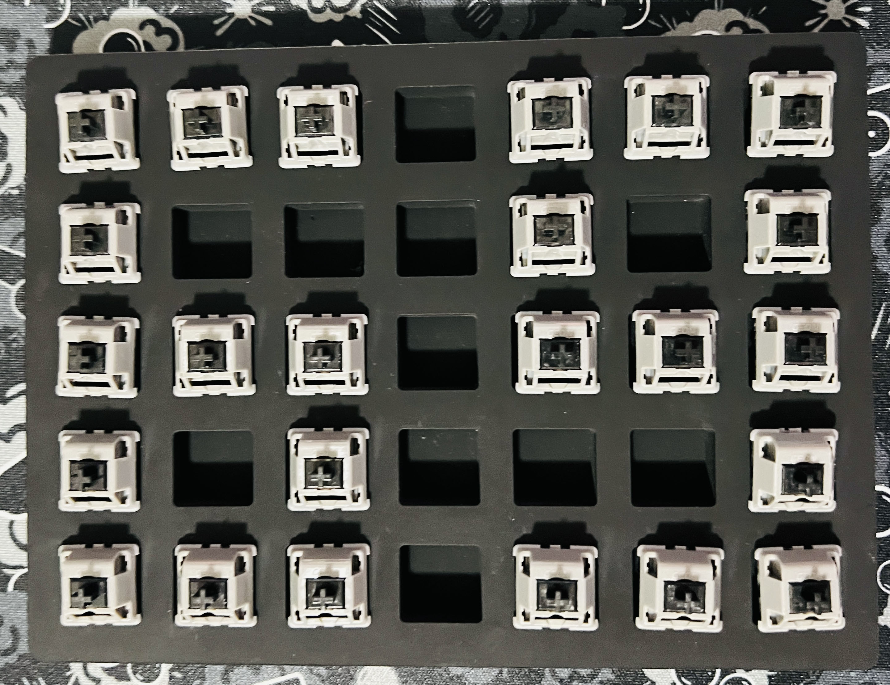
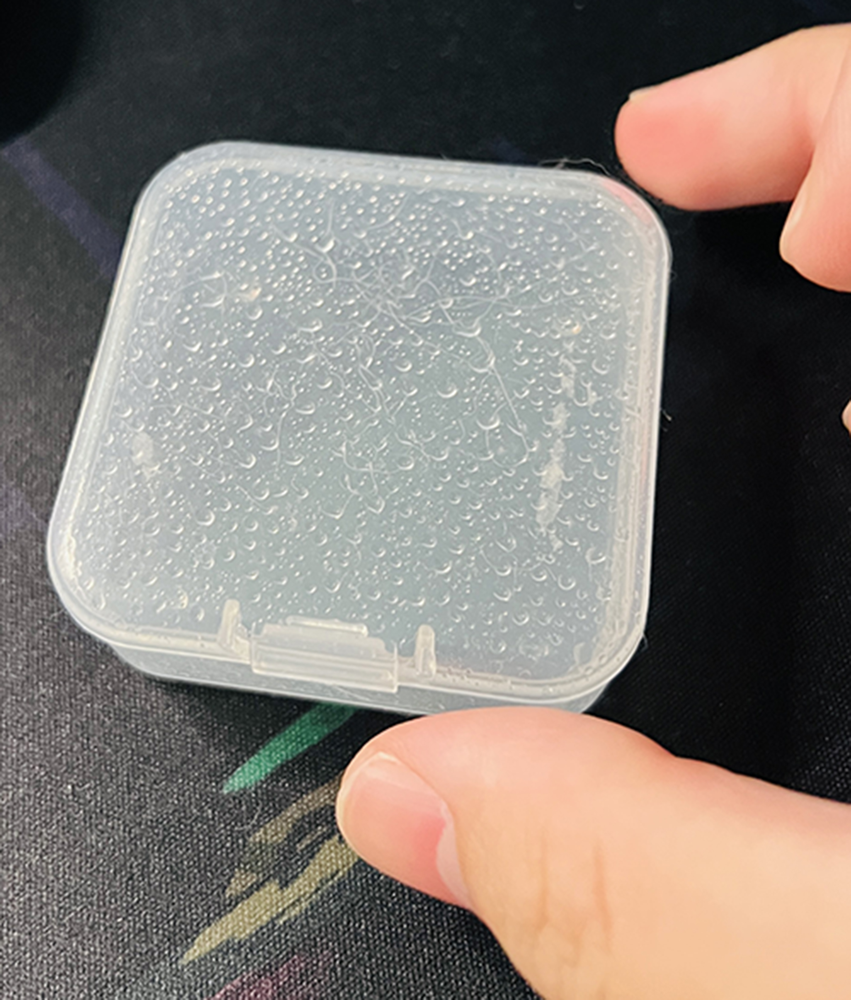
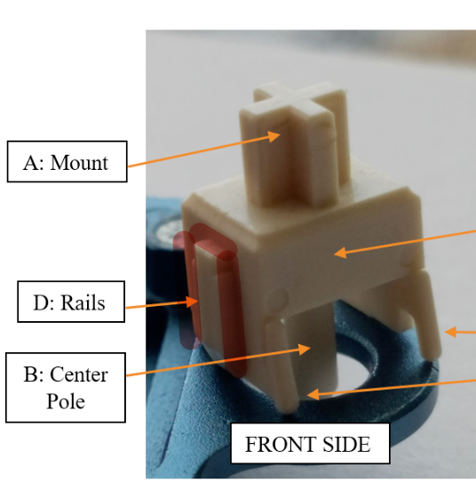
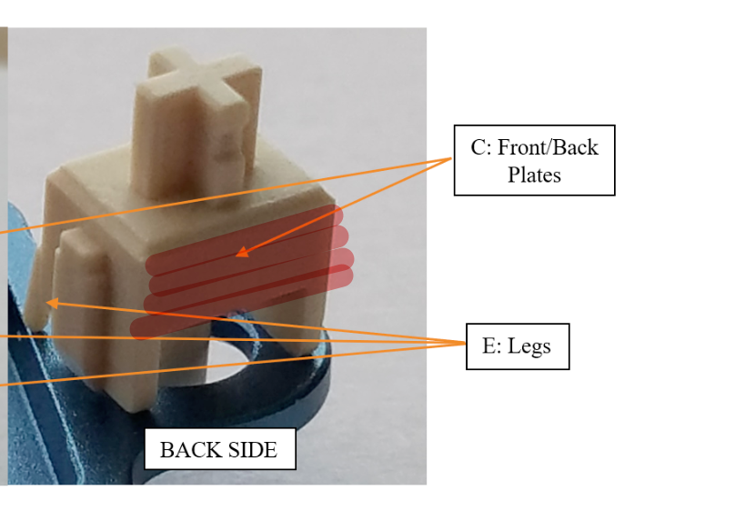

## Intro for Intro  
> This post's TA are Chinese,
> So the entire post was written in Chinese. 

## 前言  
> 潤軸沒有絕對  
- 本篇不會解釋為什麼要潤軸  
  
- 以下提供的方法只是我個人習慣  
可以只選取你覺得有料的 加以學習  
你不贊同的 可以無視或友善的討論  

- 以下提供的方法並非我個人原創  
所包含的技術可能從各種影片或是自身經驗學習而來  
但本片文章由我本人一字一句撰寫出來

**TL,DR** 
> 不負責聲明: 以下方法僅供參考 並非絕對

## 工具清單  
### 必需品  

- 開軸器  
- 潤軸筆  
- 軸潤油  
- 彈簧油  

### 非必需 但建議要有的工具  

- 空的裝軸的盒子數個  
  (比如Geon, Gateron, Drop會給35裝的盒子)  
- 有滴管的安瓶  
- 空的且乾淨小盒子 最好能密封  
  (比如lumia的彈簧盒)  
- 床頭的衛生紙  
- 媽媽廚房的廚房紙  
- 夾軸器 (夾軸心的)  
- 各種鑷子 (碳纖維佳)  
- 螢幕燈/ 書桌燈  
- 放大鏡  

### 為何要以上額外的工具  
- 空的裝軸的盒子數個  


如上圖 
> PS: 圖片是在潤ug 要一顆一顆的潤 所以才會這樣擺放  
> 正常35格都會是擺滿軸座  

這個盒子主要用來裝軸座 一般數量為`35`個  
我潤軸的過程中會按照順序處理  
反而不會一顆一顆的潤  
~~盒子潤比潤軸台實用多了~~  

濃縮順序:  

1. 試潤5顆 測試滿意  
2. 拆軸&放軸座到盒子  
3. 潤彈簧&晾乾彈簧  
4. 放彈簧  
5. 潤軸心 潤完就放在軸座彈簧上  
6. 蓋上蓋  

`35` 個為一組循環 也好控制數量  
可以預先把所有的軸拆開 把軸座都放在盒子裡  
有時間再來潤

- 有滴管的安瓶  

我會把整罐105都倒進安瓶裡 畢竟105的蓋子就很抽象 蓋都蓋不緊
有滴管也可以很好的控制油的量

- 空的且乾淨小盒子 最好能密封  

  
彈簧放進去 油滴進去 開搖 完事
簡單粗暴  

> 油量這邊建議用滴管滴 35顆彈簧大概2~3滴 依照正比增加油量  

- 床頭的衛生紙  

> 不必解釋了吧  大家都懂  

- 媽媽廚房的廚房紙  

彈簧搖完 我會把彈簧分開坦平在廚房紙上  
再蓋上一張 拿一個稍微有點重量的東西壓在上面  
靜置10分鐘到30分鐘 (時間隨便 看心情 急的話幾分鐘就好)  
這樣是預防彈簧發出撲次撲次的聲音  
`如果彈簧是用刷的就沒必要了`  

- 夾軸器 (夾軸心的)  

> 都2023了 不會還用手拿軸心吧

- 各種鑷子 (碳纖維佳)  

各種地方都會用到 好比說夾彈簧  
建議碳纖維是怕刮傷套件  
手抖不小心滑掉 會傷到自己的寶貝  

- 熒幕燈/ 書桌燈  

我桌子剛剛好在背光那一面  
所以需要一盞燈 看油有沒有確實塗抹在軸心上
如果家裡光線條件好 可以略過

- 放大鏡 （友人推薦 我自己是用不到）

仔細看原本軸體有沒有油  
還有看上蓋裡面的導軌密合度 
如果太密合放進去 會把油擠出來 會看到上蓋旁邊有一點點油  
還有自己的油有沒有塗均勻  

### 推薦清單 (無葉配)  
潤軸菜單
- 潤軸: Geon粗筆 (強烈建議)  
- 夾軸: Tx夾軸筆 或是 Geon夾軸筆  
- 軸心: 杜邦205g0 / Tribosys 3204 / Payson 3204  
- 彈簧: 杜邦105  
- 衛星軸假軸: 杜邦205g0/ 杜邦205g0 mix 105  (衛星軸雖然不在本篇內容 但一樣包含給你)  
- 衛星軸填充: XHT/Hvg

額外配件
- 軸間紙: Deskey, Tx
- 彈簧: Geon, Tx

其他能用就行  

## 潤前準備  

首先要注意軸有沒有廠潤  
如果有 `建議` 用酒精溼紙巾或是沾酒精的棉花棒把廠潤洗掉  
再講究一點會用超聲波去清洗廠潤  
好比說: 廠潤有在底座軸心柱裡面的奶油蘇打 ~~幹~~

然後先拿4~5顆試潤一下 只潤小腳跟導軌  
上機測試 qwer排> asdf排 > zxcv排 > 大鍵  (懶得話就 asdf排> 大鍵)  
`千萬不要手按或是試軸器 超級不準 只是聽個響而已`  
再視情況增加減少潤軸面積 好比說段落軸可能不潤小腳效果更好  
這樣做是怕一股腦兒全部潤完 結果自己不喜歡要重潤  
畢竟每個軸體都會有些許的不同  所以每一顆不一定可以用相同方法去潤  

## 潤軸  

> 此潤軸方式目的是為了減少軸體運動過程的雜音  
> 滑順度不在本篇範疇內  

這邊重點只會講潤軸心  
彈簧已經在盒子跟廚房紙部分詳細說明了  
其他我也不太潤  好比說上蓋或是軸座
追求是整體的一致性 而不是極致的聲音  

### 沾油
沾完 在油的上蓋轉一轉 再往軸心上刷  
> PS: 這邊可能要注意一下筆刷吃油性 有些不太好筆刷可能會油都會被抹掉  
> 如果為了安全 建議直上Geon的粗筆  

這樣可以控制油的量 薄薄的上一層油即可  
薄潤效果就很好了  除非你喜歡非常悶的聲音  

### 軸心潤滑
> 粗潤只潤有接觸的地方 可以仔細刷也可以用點的方式讓油在後期按壓的時候自然暈開  
> 精潤接觸面全潤並且仔細刷 避免任何問題  

  
<center>圖一</center>  

- 軸心正面  

> 粗潤: 可以只潤小腳 中間點一滴油 讓他在後期按壓的時候自然暈開  
> 精潤: 仔細刷小腳正面 中間刷滿讓油鋪滿整個表面 (推薦薄潤再像我這樣刷)  
> 段落軸: 小腳需要測試 看自己喜不喜歡  

 
<center>圖二</center>  

- 軸心側面  

> 粗潤: 仔細刷凸出來的縫隙跟凸出來的表面 （請融合上圖一跟圖二的標記區域）  
> 精潤: 包含粗潤的所有部分 側面全刷 刷好刷滿  

  
<center>圖三</center>  

- 軸心背面  

> 粗潤: 只刷中間 如圖一  
> 精潤: 背面全刷 如圖三  


## FAQ

> Q1. 什麼叫Break-in  

也被稱之為壓軸  
Hyperglide(HG) 軸壓過會叫Ultraglide Black 簡稱UG  
Cherry茶軸壓過而會被叫 ButterBrown  
一般會以 Break-in xxx times來形容軸壓了多次   
通過機器去模擬人為壓軸的行為, 一般會壓幾十萬次或是到一百萬次  
讓軸心上蓋底座互相磨合更加滑順  

> Q2. 為什麼UG要分開潤？  

如Q1的解釋  
因為軸的零件經過互相磨合 已經變成彼此的形狀了  
所以要分開潤 以免搞混  

> Q3. 彈簧搖過了 可是還是有彈簧音怎麼辦?  

換就對了 代表原本的彈簧真的不行  
目前我常用的是: `Tx` , `Geon`  
lumia有時候搖過還是會...  

> Q4. L&F是什麼意思  

Lubed & Film  潤過跟加軸間紙  

> Q5. 承上題, 為什麼要加軸間紙  

常見有以下幾種情形可以加上軸間紙:  
1. 上下蓋不夠緊 會輕微晃動  
2. 軸壓過  
3. 追求更紮實的聲音  

> Q6. 段落軸 潤小腳不是會減少段落感嗎?  

確實,但就一點點  
我願意犧牲一點點段落感去換聲音  
就看你自己的取捨了  

> Q7. xx換色 真的是只換色嗎?  

不是, 都是騙你的  

> Q8. 有推什麼軸體嗎?  

我覺得很看個人， 但我可以跟你說我擁有哪些:
醜話說在前面 我有的 但有些我不一定推薦    
```
段落:
- drop invry holypanda * 110
- drop holypanda x * 105
- zeal purple v2 * 110 
- tecsee geon white * 105

線性:
-  gateron raw * 70 (lubed)
- gateron mordern grey * 70
- gateron cream soda * 90 (lubed & film) 
- gateron x * 70 (lubed & film) 
- gateron mizu minks * 70
- gateron minks * 70
- jwk soct * 70 (lubed)
- jwk mauve * 70
- jwk commute * 70 (lubed)
- tecsee geon black * 175
- tecess geon yellow * 70
- tecess darkmoon * 70 (lubed)
- cherry nixie * 120 
- cherry utlraglide black * 200+ (lubed & film) 
```