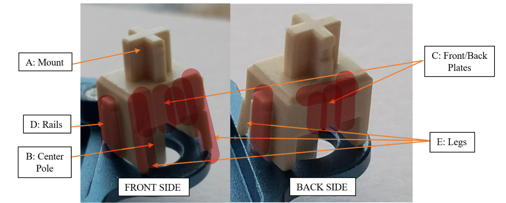

## Intro
This article is about switch lubrication tutorials.  
If you're looking for English verison, it is not available yet.  
---
潤軸只是輔助 軸爛的話建議丟了  
本篇會持續更新 跟修正 再麻煩多多回來光顧了  
最後更新時間: 2024-03-06 
<!-- more -->

## 更新資訊
- 2024-03-06  
  - 更新彈簧潤滑油脂
  - 更新彈簧潤法方式
  - 更新潤壓過的軸的方式
  - 更新潤軸方式

## 前言  
- 本篇不會解釋為什麼要潤軸  

- 以下提供的方法只是我個人習慣  
可以只選取你覺得有料的 加以學習  
你不贊同的 可以無視或友善的討論  

- 以下提供的方法並非我個人原創  
所包含的技術可能從各種影片學習或是自身經驗累積而來  
但本片文章由我本人一字一句撰寫出來

**TL,DR** 
> 不負責聲明: 以下方法僅供參考 並非絕對

## 人權
- [我擁有軸體](https://aus71n.notion.site/Switches-4c58baf779904111abf198fbc325a94a?pvs=4)  
- 賣掉的一些自己潤的軸體 大約500多顆  
- 數次代潤 沒仔細算 一定破千 

## 工具清單  
### 必需品  

- 開軸器  
- 潤軸筆  
- 軸潤油  
- 彈簧油  

### 非必需 但建議要有的工具  

- 空的裝軸的盒子數個  
  (比如Geon, Gateron, Drop會給35裝的盒子)  
- 有滴管的安瓶  
- 空的且乾淨小盒子 最好能密封 要有一定空間提供彈簧搖晃
 （推薦280ML的保鮮盒子）   
- 媽媽廚房的廚房紙  
- 夾軸器 (夾軸心的)  
- 各種鑷子 (碳纖維佳)  
- 螢幕燈/ 書桌燈  
- 放大鏡  

### 推薦清單 (無葉配)  
潤軸菜單
- 潤軸: Geon粗筆 (強烈建議)  
- 夾軸: Tx夾軸筆 或是 Geon夾軸筆  
- 軸心: 杜邦205g0 / Tribosys 3204 / Payson 3204  
- 彈簧: 杜邦106 / 107 (反推杜邦105)  
- 衛星軸假軸: 杜邦205g0 / Tribosys 3204  (衛星軸雖然不在本篇內容 但一樣包含給你)  
- 衛星軸填充: XHT (唯一推薦)

額外配件
- 軸間紙: Deskey, Tx, Swagkeys
- 彈簧: Geon, Tx, Spring

其他能用就行  

## 潤前準備  

首先要注意軸有沒有廠潤  
如果有 `建議`  用酒精溼紙巾或是沾酒精的棉花棒把廠潤洗掉  
再講究一點會用超聲波去清洗廠潤  
尤其是場潤有潤到軸心柱裏面的軸  

> 以下步驟我會跳過 我比較懶  
> 但不這樣測試很賭  不適合就要整組重潤  
> 自己斟酌  

然後先拿4~5顆試潤一下 只潤小腳跟導軌  
上機測試 qwer排> asdf排 > zxcv排 > 大鍵  (懶得話就 asdf排> 大鍵)  
`千萬不要手按或是試軸器 超級不準 只是聽個響而已`  
再視情況增加減少潤軸面積 好比說段落軸可能不潤小腳效果更好  
這樣做是怕一股腦兒全部潤完 結果自己不喜歡要重潤  
畢竟每個軸體都會有些許的不同  所以每一顆不一定可以用相同方法去潤  

## 潤軸順序
濃縮順序:  

1. 試潤5顆 測試滿意  (我比較懶我都會跳過)
2. 拆軸&放軸座到盒子  
3. 潤彈簧
4. 把彈簧放在軸座上面  
5. 潤軸心 潤完就放在軸座彈簧上  
6. 蓋上蓋  

`35` 個為一組循環 也好控制數量  
一次拆完一起潤絕對比拆一顆潤一顆來得快  
可以預先把所有的軸拆開 把軸座都放在盒子裡  
有時間再來潤

## 潤彈簧  
把彈簧對應數量的彈簧丟進盒子裏  
  

> 106/107會比105更粘稠一點 抑制彈簧音更加有效  
> 推薦現在就可以把105倒掉了 ~~什麼垃圾油~~  

每10顆1滴106/107 (可自己進行測試做調整 不是絕對)  
搖晃大概2~3分鐘  
用力搖晃 過程中搭配一些拍打  
這麼做可以讓黏在牆壁上繼續移動  
儘量讓每個彈簧接觸油的面積跟次數更多  
**接下來這一步很重要**  
你有2種選擇
1. 用鑷子夾起來一顆 在盒子邊緣敲幾下 把多餘的油抖掉  直接上軸座  
2. 倒在廚房紙上 把打結的分開  上軸座  

**強力建議**還是要自己測試 找到自己喜歡的潤法  
我對彈簧比較刁一點 因爲大部分都是組無棉 彈簧音會特別明顯  

如果還是有問題 我也不知道怎麼辦 退坑吧  ~~傻逼鍵盤~~

Q: 如何測試彈簧音?  
A:  
  

## 潤壓過的軸
什麼是壓軸? AKA: Break-in  
通過機器去模擬人為按壓軸的行為, 一般會壓幾十萬次或是到一百萬次  
讓軸心上蓋底座互相磨合更加滑順  
一般會以 `Break-in xxx times` 來形容軸壓了多少次   
壓過必須**一顆一顆的潤** 爲了避免搞混上下蓋軸心
壓過之後每一組的上下蓋軸心都是配對的
這邊主要教**如何速潤**
一樣會需要用到潤軸板/上面提到的軸盒
拆軸&放軸座到盒子裏  
如果有三個盒子: 就分別按順序放入盒子  
比如說第一顆 軸上蓋放第一盒的第一格 軸心放第二盒的第一個 以此類推  
這樣一次可以潤35顆  
條件差一點 只有一盒的話:同一顆的零件可以放同一排 以此類推  
簡單來說 有一個系統讓你可以有效率的分類 並且不會搞混  
這樣就是個好方法  
潤法跟一般的軸沒什麼差異 所以不會在此特別說明  
壓過的軸**建議**都要上軸間紙 避免上下蓋晃動雜音  

## 潤軸  

> 此潤軸方式目的是為了減少軸體運動過程的雜音  
> 滑順度不在本篇範疇內  

這邊重點只會講潤軸心  
彈簧已經在上面說明了  
其他我也不太潤  好比說上蓋或是軸座
追求是整體的一致性 而不是極致的聲音  

### 沾油
沾完 在油的上蓋轉一轉 再往軸心上刷  
> PS: 這邊可能要注意一下筆刷吃油性 有些不太好筆刷可能會油都會被抹掉  
> 如果為了安全 建議直上Geon的粗筆  

這樣可以控制油的量 薄薄的上一層油即可  
薄潤效果就很好了  除非你喜歡非常悶的聲音  

### 軸心潤滑
> 由清脆到悶(相對): 薄潤> 粗潤 > 精潤  
> 粗潤只潤有接觸的地方 可以仔細刷也可以用點的方式讓油在後期按壓的時候自然暈開  
> 薄潤只潤導軌跟小腳 讓軸心儘量乾淨 油量能少則少  
> 精潤接觸面全潤並且仔細刷 避免任何問題  

  

圖一
  

- 軸心正面  

> 薄潤: 仔細刷小腳正面 其他不碰  
> 粗潤: 可以只潤小腳 中間點一滴油 讓他在後期按壓的時候自然暈開  
> 精潤: 仔細刷小腳正面 中間刷滿讓油鋪滿整個表面 
> 段落軸: 小腳需要測試 看自己喜不喜歡  

 

圖二
  

- 軸心側面  
  
> 薄潤: 仔細刷凸出來的縫隙跟凸出來的表面 （請融合上圖一跟圖二的標記區域）  
> 粗潤: 側面全刷  
> 精潤: 如同薄潤

  

圖三
  

- 軸心背面  

> 薄潤: 跳過  
> 粗潤: 背面全刷 如圖三  
> 精潤: 只刷中間/或是在中央點一下 如圖一  

## 工具解釋
- 空的裝軸的盒子  

如上圖 (圖中是: Wuque Studio的潤軸盒子)

這個盒子主要用來裝軸座 一般數量為`35`個  
我潤軸的過程中會按照順序處理  
反而不會一顆一顆的潤  

- 有滴管的安瓶  

我會把整罐105都倒進安瓶裡 畢竟105的蓋子就很抽象 蓋都蓋不緊
有滴管也可以很好的控制油的量

- 空的且乾淨小盒子 最好能密封  

彈簧放進去 油滴進去 開搖 完事
簡單粗暴  

> 油量這邊建議用滴管滴 35顆彈簧大概2~3滴 依照正比增加油量  

- 媽媽廚房的廚房紙  

我看心情會晾一下彈簧  
pann總還是會把所有彈簧分離坦平在廚房紙上 大概1~2分鐘左右

- 夾軸器 (夾軸心的)  

都2023了 不會還用手拿軸心吧

- 各種鑷子 (碳纖維佳)  

各種地方都會用到 好比說夾彈簧  
建議碳纖維是怕刮傷套件  
手抖不小心滑掉 會傷到自己的寶貝  

- 螢幕燈/ 書桌燈  

我桌子剛剛好在背光那一面  
所以需要一盞燈 看油有沒有確實塗抹在軸心上
如果家裡光線條件好 可以略過

## FAQ

> Q: 什麼叫Break-in  

也被稱之為壓軸 煲軸 上面也有介紹了  
常見會拿去壓的 一般都是Cherry的`HG(Hyperglide)`系列軸體  
因為沙沙的聲音是他們家的特色  但有些人不喜歡沙沙的聲音  
就會拿去壓 讓軸體更加的滑順 減少沙沙聲  
黑軸(Black): 壓過被稱之為 `Ultraglide Black` 簡稱UG  
茶軸(Brown): 壓過被稱之為 `ButterBrown` 簡稱BB  
當然幾乎什麼軸都可以壓 只是效果好不好就需要自己測試了  

> Q: 彈簧搖過了 可是還是有彈簧音怎麼辦?  

改106/107有效根治問題  
也可以用205或是3204刷彈簧的兩端解決這個問題  
是不是暫時的我就不是那麼確定了  
之後找到更好的解法再更新  

~~換就對了 代表原本的彈簧真的不行~~  
~~目前我常用的是: Tx , Geon~~    
~~Lumia有時候搖過還是會...~~   (2024-11-14更新移除)  

> Q: 段落軸潤完有彈片音  

目前沒救 只能容忍他

> Q: L&F是什麼意思  

Lubed & Film  潤過跟加軸間紙  

> Q: 為什麼要加軸間紙  

常見有以下幾種情形可以加上軸間紙:  
1. 上下蓋不夠緊 會輕微晃動  
2. 軸壓過  
3. 追求更紮實的聲音 
4. 乳殼上蓋 (e.g. : 佳達隆各種乳殼) 

Film的時候請注意正反 撕下來哪一面朝上就是哪一面朝上  
好比說deskey 亮面是朝下的 poron朝上  

> Q: 段落軸 潤小腳不是會減少段落感嗎?  

確實 但就一點點  
我願意犧牲一點點段落感去換聲音  
就看你自己的取捨了  

> Q: xx換色  xx同模 真的一樣嗎?  

不是 都是騙你的  
有些換色味道還是會變  
像是鈷藍家族 或是 Ink黑換色  

> Q: 我好懶 可以買廠潤嗎？  

**建議不要**  
除非沒時間或是個別幾家場潤比較靠譜的  
有些廠潤很拉跨 不如不要潤  
直接往軸心柱加油 或是油量爆幹多  
還要拿去超聲波  不如自己潤一潤  
相信自己的手藝 都比廠潤好  
前提是你有那個美國時間啦  
沒時間的話 要麼代潤 要麼廠潤咯  
