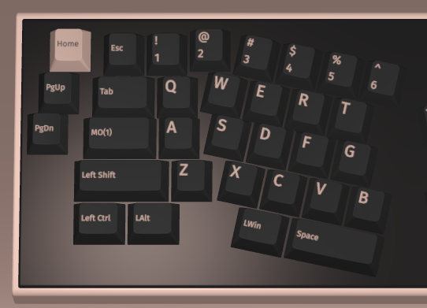
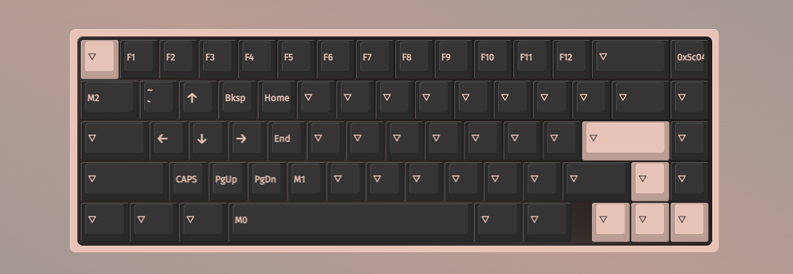
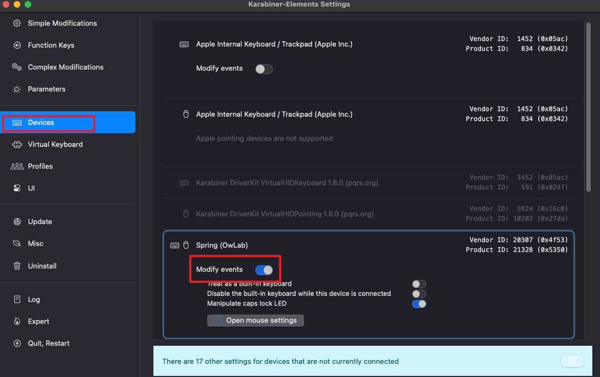
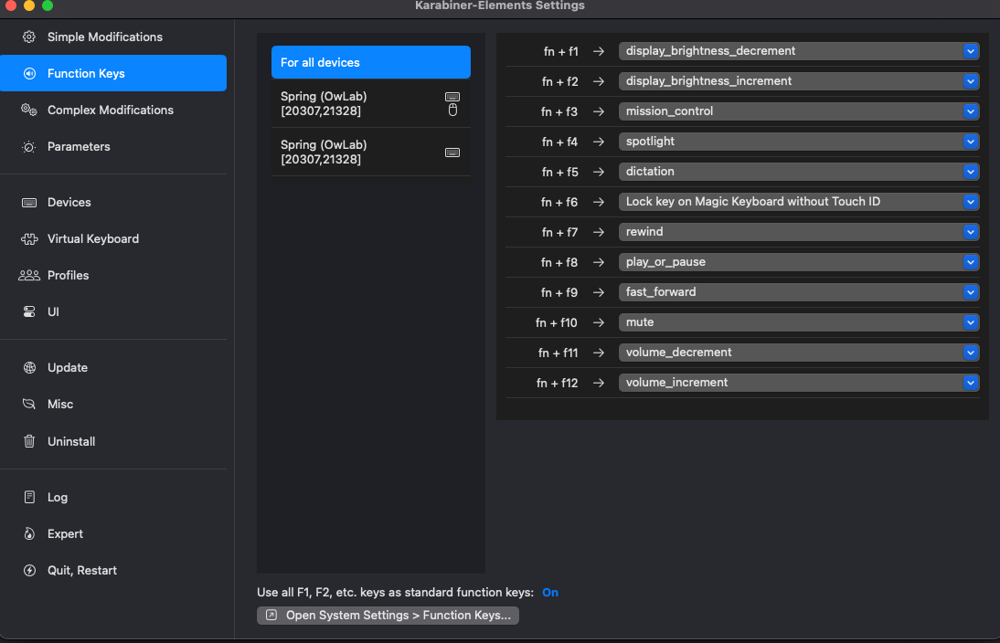
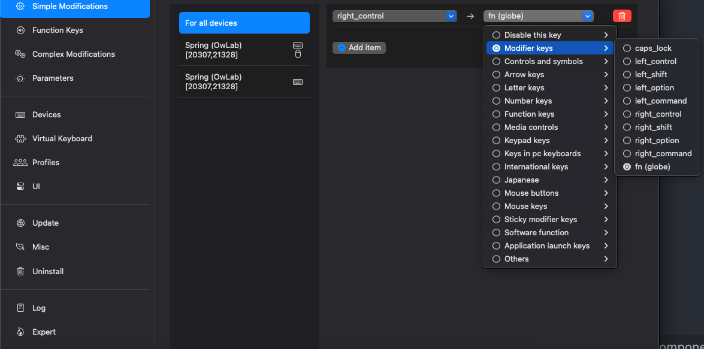
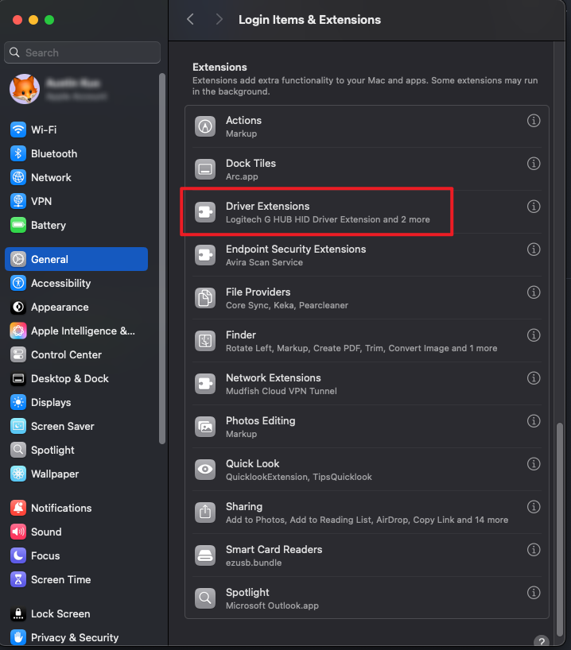
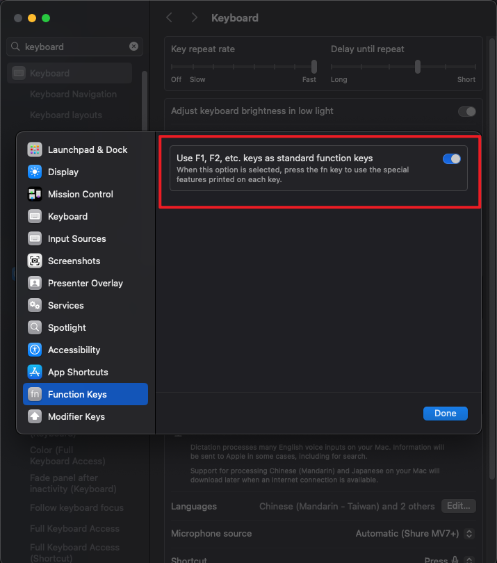

## Intro

如果你已經習慣了`MacBook`上原生的鍵盤  
換到客製化後可能會有許多問題需要克服  
相信你很頭痛  
但如果你的鍵盤支援 `VIA` 大部分問題都可以迎刃而解  
我可以大概列出一些讓你頭痛的問題:

<!-- more -->

- 缺少 Apple 原生 fn (比如 function 效果的切換 F12 跟聲音控制)
- Win Alt 相反 (尤其是 Win/MacOS 雙修的人)
- 小配列鍵位不知道怎麼設定才順手 (比如 60%的上下左右/65%的~鍵)
- 甚至你在挑戰 60% 或是更小的配列

我可以分享幾點來解決你的痛點  
甚至可以說這篇是 `VIA` 詳細的使用說明  
希望這篇文可以讓你一次征服所有痛點

## 鍵位調配

要讓設定舒服有一個前提，就是你的打字姿勢是要標準的 **越標準越吃香**  
`VIA` 可以將 Layout 拆成好幾層  
我們這次主要會調整`Layer1`， `Layer0`有些小調整

Layer0 設定範例:

首先我們把`MO(1)`丟到`Capslock`的位置  
如果你很常用`Capslock`
請在 Special 分頁裡面找到`Any`  
輸入:

> LT(1,KC_CAPS)

這樣就變成長按進到`Layer1`， 短按就是 Capslock

Layer1 範例設定(請依照自己的習慣調整):  


1. 首先無 M1 M2 M3..這些鍵 (這些是我設定的巨集鍵 下面會展開)
2. 上下左右可以設定在 WASD/IJKL 看你是左撇子還是右撇子
3. Function 鍵全部會設定在`1~=`鍵 剛剛對應到 12 個
4. 65%以下的話 `~`鍵我習慣放在 Q 因為我蠻常用
5. 剩下是我寫 Code 常用的按鍵

這樣設定好處是 我可以用我小指去壓著 `Capslock`  
這樣鍵盤就會進入`Layer1` 左手單手就可以控制上下左右  
我右手也不需要移動  
當然你要先習慣用左手控制這一切，如果你比較習慣放右邊也不是不行  
缺點就是雙手要協調 不然就是要改`MO(1)`的位置  
目標就一個字 懶  
就要懶到一個極致 XD

## WIN ALT 對調

對於非雙系統雙修的人類  
我們可以簡單粗暴的直接在`Layer0`  
把`WIN`,`ALT`對調  
再優雅一點的話 需要設定 2 顆`any` 你可以放在任何地方

> 0x5C04  
> 0x5C0D

`0x5C04` 是`左邊ALT` 跟 `左邊WIN`對調  
`0x5C0D` 則是對調回來  
注意是 左邊！ 左邊！ 左邊！  
如果要左右對調 或是 對調右邊， 請參考[這裡](https://github.com/qmk/libqmk/blob/master/include/qmk/keycodes/quantum.h)

> 注意有些 PCB 不支援一鍵對調 那你就只能直接改鍵對調了

## 大魔王 APPLE FN

如果你不用 Apple 的媒體鍵(比如調亮度 聲音)  
或是不用 Function Row  
那你就可以跳過這一題了
但如果你好死不死，兩個都用得很頻繁  
那就需要依靠一個程式來解決了

0. 設定一顆 `Right CTRL` 在空格右邊那顆 或是任何你喜歡的位置
1. [安裝 Karabiner-Elements](https://karabiner-elements.pqrs.org/)
2. 他 Karabiner 需要的權限全開(他應該會提示你權限不足)

3. 到 Device 把你鍵盤的 Modify-Event 打開  
   (一把鍵盤可能會有多個 你可以全開)



4. (非必要) 到 Function Keys 稍微調整一下映射 你也可以直接照抄我的



5. 取代所以鍵盤`Right CTRL` 或是你任何用不到的鍵



這樣只要`Right CTRL` + `Capslock` + `1~=` 就可以觸發 Apple 任何媒體鍵了

> 如果沒反應代表以上步驟你有漏的 或是權限沒開  
> 常見是 Driver Extension 這邊沒開  
> 

## 結語

經過以上調教 基本上你在`MacOS`上使用體驗會舒服蠻多  
但有些需要一些時間習慣  
希望這篇文章有幫到你 解決你的頭痛  
如果你的鍵盤不支援`VIA`  
趕快買一把客製化來改善你的 Work Flow 吧  
`VIA`絕對是客製化最爽的地方  
而且所有設定是存在 PCB 的記憶體裡  
今天不管你換到哪一臺電腦 插上即用 **阿斯阿斯**

## FAQ

### Q: VIA 連不上怎麼辦

A. Debug 順序如下

> 換瀏覽器或是電腦版 > 換條線 > 開啟或關閉 V2 > 換 JSON > ~~再買一把~~

### Q: VIA 怎麼改鍵

A. 找到你要改的鍵 點一下， 然後再下方尋找你要替換的鍵  
慢慢找 沒有捷徑 多翻幾次就記得了 XD

### Q: LT(1,KC_CAPS) 有什麼用?

A. LT 全稱叫`Tap Dance` 縮寫可能沒什麼關係
直接抄一個大哥的作業

```
LT(1,KC_CAPS): 按住切層mo(1),短按大寫鎖定
LT(1,KC_RCTRL):按住切層mo(1),短按R_ctrl
LT(2,KC_F5):按住切層mo(2),短按F5
```

~~shout out to my babe HHHHW~~

### Q: Hexcode 對照表呢？

A.
當你設定`Any`鍵的時候 你會感謝有他

- [點我看 一般鍵位](https://github.com/qmk/libqmk/blob/master/include/qmk/keycodes/basic.h)
- [點我看 特殊鍵位](https://github.com/qmk/libqmk/blob/master/include/qmk/keycodes/quantum.h)

### Q: 如何設定 Marco(巨集)

A. ↓

> 如果你知道我是誰 直接 DM 我 DC 我手把手教你  
> 如果你不知道我是誰 就自己看[Youtube](https://www.youtube.com/watch?v=aKQH09xxWEU)吧  
> 解釋需要的篇幅比較長 我就懶得解釋了 QQ

### Q: 如何預設是 Function Row 則不是媒體鍵

A. ↓

**反之亦然**

### Q: 我的問題不在 FAQ 怎麼辦

> 
